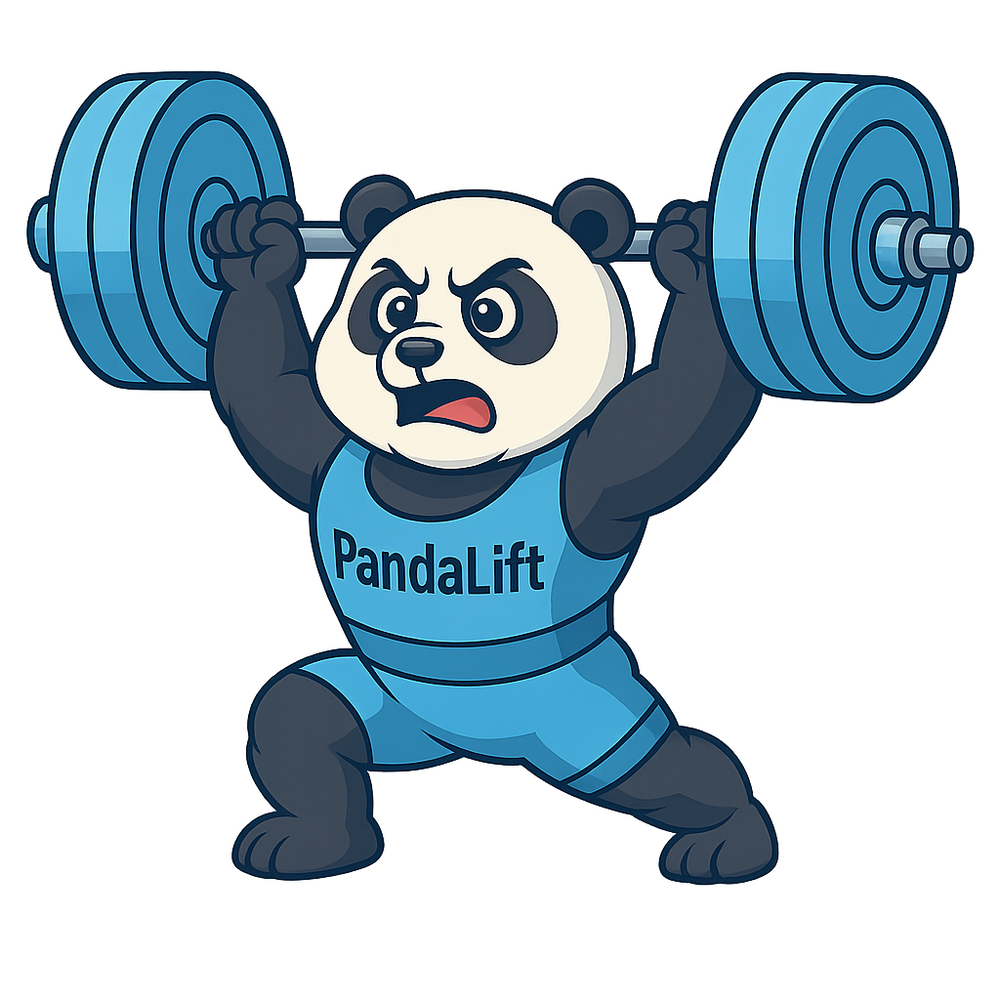

# 🐼 PandaLift

**Donde entrenadores y atletas crecen juntos.**  
PandaLift es una plataforma profesional de halterofilia que conecta entrenadores y atletas mediante herramientas inteligentes y diseño moderno.

  

---

## ✨ Características

- 🏋️ Rutinas personalizadas por nivel y objetivo
- 📈 Visualización de estadísticas de progreso
- 🤝 Comunidad y feedback de entrenadores
- 🔐 Privacidad y seguridad de datos
- 🤖 Integración con inteligencia artificial (En proceso...)
- 💬 Feedback inteligente con IA (En proceso...)
- 🔁 Login con Google o email

---

## 🚀 Tecnologías utilizadas

- [Astro](https://astro.build) – Framework ultrarrápido
- [React](https://reactjs.org) – Login y modales dinámicos
- [Tailwind CSS](https://tailwindcss.com) – Estilos modernos
- [Firebase Auth & Firestore](https://firebase.google.com) – Autenticación y datos
- [Alpine.js](https://alpinejs.dev) (opcional) – Control de UI reactiva simple
- [Tabler Icons](https://tabler-icons.io) – Iconografía elegante

## 🪪 Licencia

Este proyecto está licenciado bajo la [MIT License](LICENSE).
